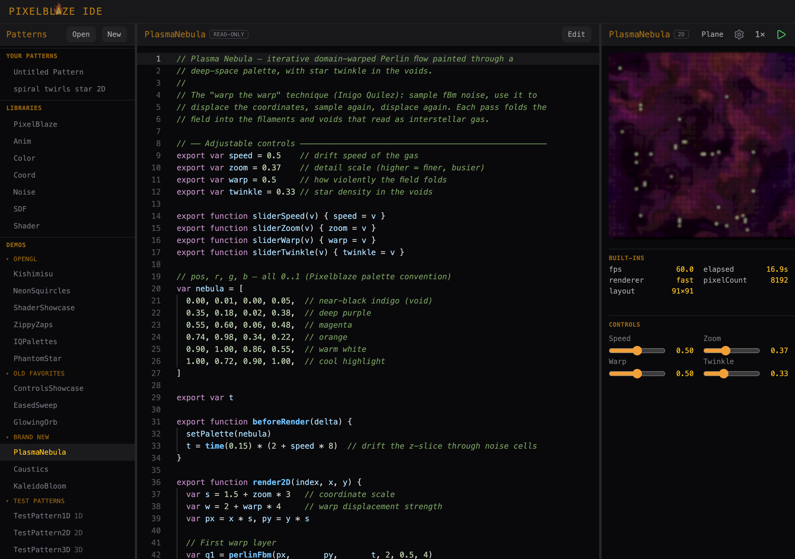

# Pixelblaze IDE v2

A browser-based pattern editor for [Pixelblaze](https://electromage.com/) LED controllers — write, preview, and tune patterns entirely offline, then paste the result straight onto your device.

**[Open the IDE →](https://jon-whiteroomsoftware.github.io/pixelblaze-v2/)**



---

## Why this exists

[Pixelblaze](https://electromage.com/) is a tiny WiFi controller that drives addressable LED strips, matrices, and 3D sculptures. It ships with a built-in code editor, but that editor only works with a controller plugged in, gives you a bare text box, and has no way to share code between patterns.

This IDE fixes all three:

- **No hardware required.** Everything runs in your browser — editing, compiling, and a live animated preview. No device, no network, no backend.
- **A real editor.** Monaco (the engine behind VS Code) with autocomplete, signature hints, and live error checking for the Pixelblaze dialect.
- **Reusable libraries.** Pull in shared functions with `SDF.circle(...)` or `Anim.ease(...)`. The compiler tree-shakes and inlines only what you actually call, so the artifact stays small enough for the device.

## What makes the preview interesting

The preview isn't just a quick approximation — it's built to match the hardware.

- **1D, 2D, and 3D.** Render your pattern as a strip, a ring, a pole, a flat grid, or an orbiting 3D cube you can drag and spin. The shape is a display choice; a 1D pattern can be wrapped onto any of them.
- **Hardware-faithful math.** Pixelblaze runs 16.16 fixed-point arithmetic, not floats. Flip the preview to **Precise** mode and it emulates that exact arithmetic — overflow, precision loss, and all — validated against a real controller. So what you see in the browser is what the device will actually do. A **Fast** float64 mode is the default for smooth everyday editing.
- **Live controls and var watching.** Export a `sliderX`, `toggleX`, or color-picker function and the IDE renders the matching widget — the same controls the hardware shows. The Var Watcher tracks every exported variable, refreshed each frame.

This makes the IDE a comfortable home for porting GPU-style shaders (ShaderToy and friends) onto LEDs, where trusting the preview really matters. There's a `Shader` library and a [porting guide](docs/guides/Porting%20ShaderToy%20shaders%20to%20Pixelblaze.md) for exactly that.

## Bundled libraries

Hover any library in the left pane for a summary; click to open its source.

| Library  | What it provides |
| -------- | ---------------- |
| `SDF`    | 2D signed distance fields — circles, rects, rings, stars, polygons, smooth boolean ops |
| `Anim`   | Easing curves, oscillators, phase timing, looping animation primitives |
| `Color`  | HSV/RGB blends, palette interpolation, colour math |
| `Coord`  | Polar coordinates, rectangular↔polar conversion, spatial transforms |
| `Noise`  | Value noise, Voronoi distance, organic variation |
| `Shader` | GLSL gap-fillers (`fract`, `step`, `dot`, `reflect`, palettes) for shader ports |

The **Demos** section has ready-to-run examples — animated SDFs, eased sweeps, noise flow fields, and several shader ports. They're read-only, but "Edit" forks any demo into your own editable copy.

## Getting patterns on and off hardware

- **Copy Code / Download** — the editor emits a single flat `.js` file with every library function inlined and `export` keywords preserved, exactly the format the device expects. Paste it into the built-in Pixelblaze editor, or save it to upload. (Disabled while your code has a compile error.)
- **Import** — open `.epe` files exported from the Pixelblaze hardware editor; they land as new editable patterns.

Direct upload to a controller over the network isn't wired into the app yet — for now, Copy Code is the bridge.

## Running locally

```bash
npm install
npm run dev      # Vite dev server
npm test         # Vitest suite
npm run build    # type-check + production build
```

## Good to know

- **Patterns run on the main thread.** A genuinely infinite loop can freeze the tab — there's no watchdog.
- **`perlin` and the random functions diverge slightly** from firmware even in Precise mode; they're different algorithms, not reverse-engineered. Pure integer math is bit-identical on both sides.
- **Sound- and sensor-reactive patterns** load and run, but the sensor inputs are inert stubs, so they won't animate from audio here.

## Learn more

- **[System Reference](docs/REFERENCE.md)** — the authoritative, detailed description of how everything actually works: transpiler, validator, fixed-point engine, maps, camera, render loop.
- **PRDs and ADRs** under [`docs/`](docs/) — the *why* behind the design and the not-yet-built direction.
- **[Pixelblaze docs](https://electromage.com/docs/)** — the hardware, firmware, and language itself.
</content>
</invoke>
