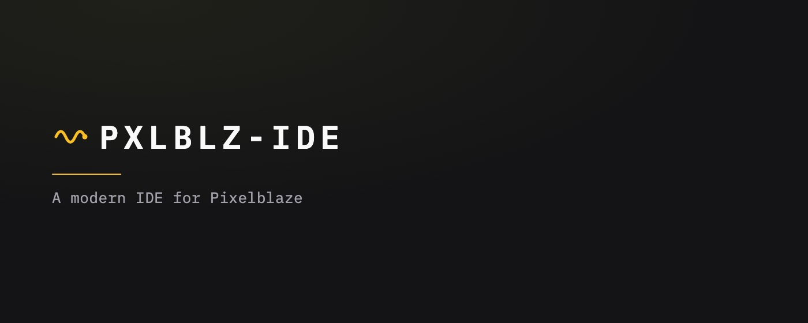
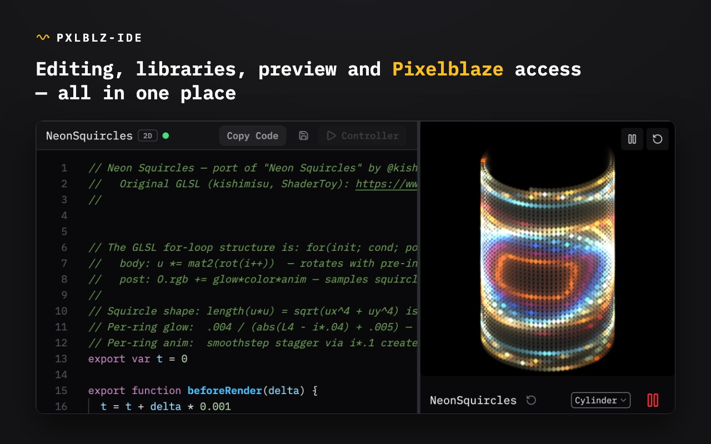
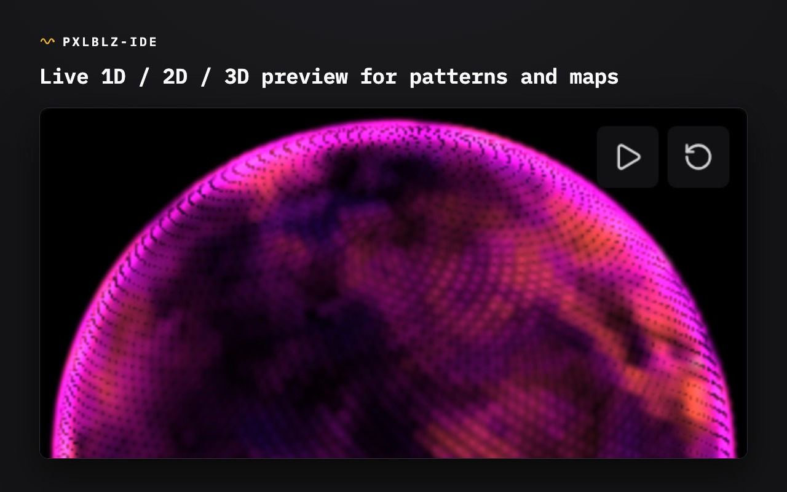
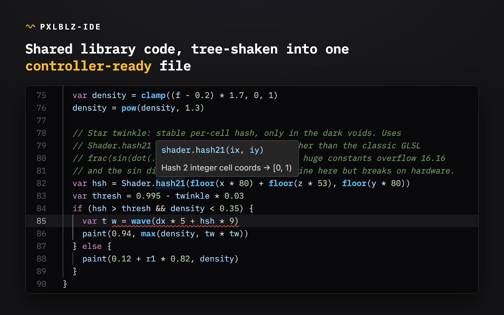
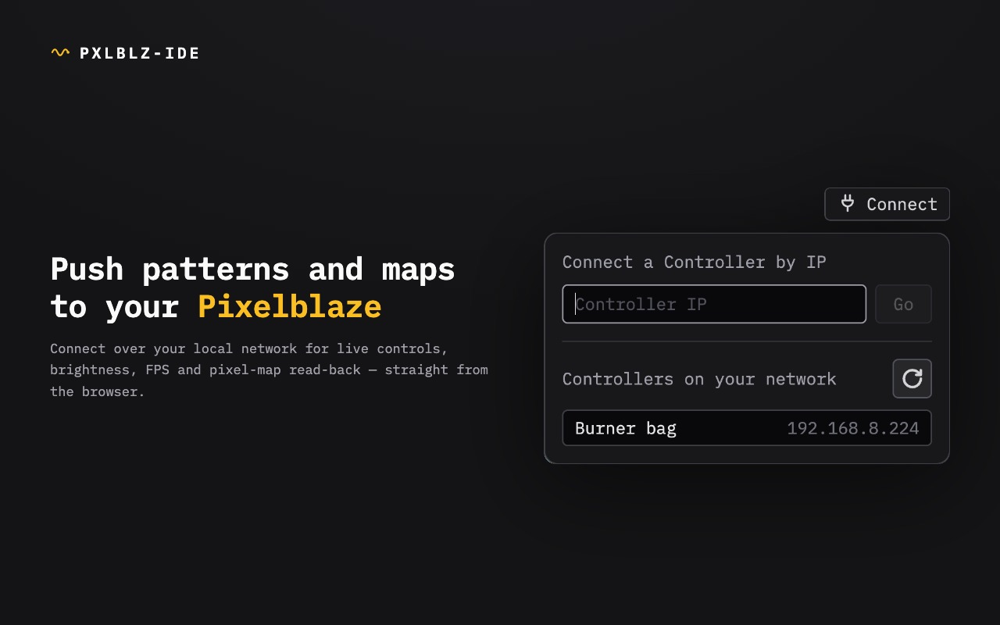

# PXLBLZ

A browser-based pattern editor for [Pixelblaze](https://electromage.com/) LED controllers — write, preview, and tune patterns entirely offline, then copy the result onto your device or push it live to a controller on your network.











**[Open PXLBLZ →](https://jon-whiteroomsoftware.github.io/PXLBLZ-IDE/)**

---

## Why this exists

[Pixelblaze](https://electromage.com/) is a tiny WiFi controller that drives addressable LED strips, matrices, and 3D sculptures. It ships with a built-in code editor, but that editor only works with a controller plugged in, gives you a bare text box, and has no way to share code between patterns.

PXLBLZ fixes all three:

- **No hardware required.** Everything runs in your browser — editing, compiling, and a live animated preview. No device, no network, no backend.
- **A real editor.** Monaco (the engine behind VS Code) with autocomplete, signature hints, and live error checking for the Pixelblaze dialect.
- **Reusable libraries.** Pull in shared functions with `SDF.circle(...)` or `Anim.ease(...)`. The compiler tree-shakes and inlines only what you actually call, so the artifact stays small enough for the device.

## What makes the preview interesting

The preview isn't just a quick approximation — it's built to match the hardware.

- **1D, 2D, and 3D.** Render your pattern on a strip, a ring, a pole, a flat grid, a wrapped cylinder, or a 3D cube, sphere, or star you can drag and spin — each as a hollow **shell** or a filled **volume**. The IDE reads your render functions to pick the dimensionality; the shape is a display choice, so a 1D pattern can wrap onto any of them.
- **The map is yours, not the device's.** A pixel map says where each LED physically sits, decoupled from its position in the chain. Pick a stock map or **write your own** — New Map opens an editor on a plain `function(pixelCount)`, the very thing a real Pixelblaze Mapper tab evaluates, so you can preview against the actual geometry of your tree, sphere, or sculpture. Load any stock map as an editable template; every one is real, pasteable Mapper code, no hidden magic.
- **Hardware-faithful math.** Pixelblaze runs 16.16 fixed-point arithmetic, not floats. Flip the preview to **Precise** mode and it emulates that exact arithmetic — overflow, precision loss, and all — validated against a real controller. So what you see in the browser is what the device will actually do. A **Fast** float64 mode is the default for smooth everyday editing.
- **Tune how it looks, not what it computes.** Preview-only viewing controls — **light size**, **diffusion** (a virtual diffuser sheet that merges the dots into a gap-free field), and **solidity** (fade a shell's back so it occludes itself) — shape the render without ever touching your pattern's math or reaching hardware.
- **Live controls and var watching.** Export a `sliderX`, `toggleX`, or color-picker function and the IDE renders the matching widget — the same controls the hardware shows. The Var Watcher tracks every exported variable, refreshed each frame.

The control deck keeps the two worlds visibly separate: a **Pixelblaze group** (the map, pixel count, brightness, Fill/Contain fit — settings that would round-trip to a device) and a **Preview group** (light size, diffusion, renderer, speed, solidity — things the IDE invents that the device never sees).

This makes PXLBLZ a comfortable home for porting GPU-style shaders (ShaderToy and friends) onto LEDs, where trusting the preview really matters. There's a `Shader` library and a [porting guide](docs/guides/Porting%20ShaderToy%20shaders%20to%20Pixelblaze.md) for exactly that.

## Bundled libraries

Open the **Libraries** menu in the header for a summary on hover; click any to open its source.

| Library  | What it provides |
| -------- | ---------------- |
| `SDF`    | 2D signed distance fields — circles, rects, rings, stars, polygons, smooth boolean ops |
| `Anim`   | Easing curves, oscillators, phase timing, looping animation primitives |
| `Color`  | HSV/RGB blends, palette interpolation, colour math |
| `Coord`  | Polar coordinates, rectangular↔polar conversion, spatial transforms |
| `Noise`  | Value noise, Voronoi distance, organic variation |
| `Shader` | GLSL gap-fillers (`fract`, `step`, `dot`, `reflect`, palettes) for shader ports |

The **Demos** section has ready-to-run examples — animated SDFs, eased sweeps, noise flow fields, and several shader ports. They're read-only, but "Edit" forks any demo into your own editable copy. The left pane filters by dimension (1D / 2D / 3D) and has a type-down name search to find things fast.

## Getting patterns on and off hardware

By hand, with no device or network:

- **Copy Code / Download** — the editor emits a single flat `.js` file with every library function inlined and `export` keywords preserved, exactly the format the device expects. Paste it into the built-in Pixelblaze editor, or save it to upload. (Disabled while your code has a compile error.)
- **Import** — open `.epe` files exported from the Pixelblaze hardware editor; they land as new editable patterns.

Or live, when a Pixelblaze is on your LAN:

- **Connect to a controller.** A small Chrome extension relays the connection a deployed web page can't open itself. Once installed, enter the controller's IP to connect; a live panel mirrors its running pattern, frame rate, pixel count, brightness, and installed map, and drives its controls in real time.
- **Send to Controller** compiles the open pattern with the *device's own compiler* and pushes it over the wire. A toggle picks the mode: **Run** plays it transiently, while **Save** persists it to the device's saved patterns and activates it — overwriting in place rather than piling up copies. You can send demos directly, without forking first. A separate action writes a custom map to the device. None of the preview-only settings ever ride along; only the pattern, and the map when you ask.

## Running locally

```bash
npm install
npm run dev      # Vite dev server
npm test         # Vitest suite
npm run build    # type-check + production build
```

## Good to know

- **Patterns run on the main thread.** A genuinely infinite loop can freeze the tab — there's no watchdog.
- **`perlin` and the random functions diverge slightly** from firmware even in Precise mode; they're different algorithms, not reverse-engineered. Pure integer math is bit-identical on both sides.
- **Sound- and sensor-reactive patterns** load and run, but the sensor inputs are inert stubs, so they won't animate from audio here.

## Where to read next

Three documents go deeper, each for a different reader — pick the one that matches why you're here:

- **[PXLBLZ Feature Guide](docs/PXLBLZ%20Feature%20Guide.md)** — *for someone who uses Pixelblaze.* What every control on the screen does: the preview, maps, the control deck, live controls, and getting code onto hardware. Start here if you just want to use the IDE.
- **[PXLBLZ Technical Reference](docs/PXLBLZ%20Technical%20Reference.md)** — *for someone building the IDE.* The authoritative as-built description of how it works: transpiler, validator, fixed-point engine, maps and embeddings, camera, render loop, storage. Start here to contribute.
- **[Pixelblaze Ecosystem Primer](docs/Pixelblaze%20Ecosystem%20Primer.md)** — *for someone new to Pixelblaze itself.* The mental model the other two assume: device vs. browser, 16.16 fixed-point, the pattern and mapper dialects, the WebSocket API. Start here if "fixed-point" or "pixel map" needs unpacking.

Beyond those: the **Technical Reference** records the *why* behind the design decisions, and the official **[Pixelblaze docs](https://electromage.com/docs/)** cover the hardware, firmware, and language itself.
</content>
</invoke>
