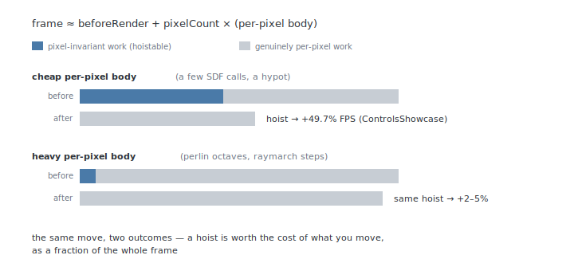
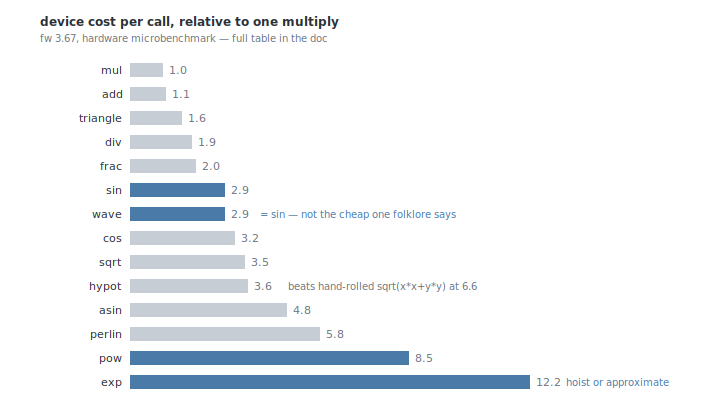

# Optimizing Pixelblaze patterns

A living guide to making patterns fast on Pixelblaze's serial, fixed-point
hardware, with measured numbers for our firmware (3.67) rather than folklore. It
covers general patterns and, with extra attention, GLSL/ShaderToy ports — the
patterns that most often blow the budget.

**The whole document in two sentences.** Pixelblaze evaluates pixels one at a time
on a single core, so a frame costs `beforeRender + pixelCount × (per-pixel body)` —
and every optimization is judged by how much of the *whole frame* it removes, not
how clever it is locally. Part 1 gives the cost model, the toolbox in order of
leverage, and the measured facts that overturn folklore; Part 2 is the
benchmarking toolchain and the measured cost table; Part 3 is the reference — the
optimization catalogue, the case studies, and the full scoreboard, each claim
tagged with how it was proven.

---

# Part 1 — Principles

## 1. Architecture gap

A ShaderToy shader runs on a GPU: thousands of cores, each evaluating one pixel in
parallel, in hardware float. A Pixelblaze runs on a **single microcontroller
core**, evaluating pixels **one at a time**, in **16.16 fixed-point**. Two
consequences dominate everything below:

1. **Cost is serial.** Frame cost is roughly

   ```
   beforeRender  +  pixels × (per-pixel work)
   ```

   On a 16×16 grid the per-pixel multiplier is 256; on 32×32 it's 1024. A loop
   inside `render` multiplies by the pixel count — a 95-step raymarch on a 32×32
   grid is ~97,000 iterations per frame.

2. **The two render functions have wildly different leverage.**

   | function | runs | put here |
   |---|---|---|
   | `beforeRender(delta)` | **once per frame** | anything identical for every pixel — time accumulation, frame-global trig, palette setup |
   | `render*` | **once per pixel** | only work that genuinely depends on the pixel's position |

   Moving one `sin()` from `render2D` to `beforeRender` on a 32×32 grid removes
   1023 evaluations per frame. This is the single highest-leverage move in the
   toolbox.

> **Fixed-point, not float.** On hardware *everything* is 16.16 fixed-point —
> there is no float mode on the device. The preview's Fast renderer is a dev-loop
> convenience and does not reflect device cost; do final checks in Precise. See
> the Technical Reference §2/§5.

## 2. Whole-frame model

The payoff of any optimization is governed by **dilution**: it's worth the cost of
the work you remove *as a fraction of the whole frame*.



The library-wide sweep (§11) applied the *same* hoist to sixteen demos and got
results from **+49.7%** to **+0.0%**. The pattern that predicts the payoff:

- **Cheap-frame demos win big.** When the per-pixel body is light, frame-constant
  trig being recomputed per pixel *is* most of the frame; lifting it nearly halves
  frame time.
- **Heavy-frame demos barely move.** Against 5–9 `perlinFbm` calls or a long
  raymarch, the same hoist is a rounding error. Only the **quality knobs** —
  octave counts, march steps, iteration counts — are levers big enough to matter,
  and those change the image (§3).
- **The firmware FPS cap hides wins.** The device caps around **~124.5 FPS** on
  our panel; a rate-capped frame can't report a saving. Read the ms/frame floor,
  not a capped 0%.
- **A 10% body cut is not a 10% frame win.** The frame also pays fixed overhead
  (walking the map, driving LEDs, housekeeping) that no pattern edit touches —
  measured on Kishimisu, the arithmetic body was only ~44% of the frame. Model the
  whole frame before predicting an FPS number.

## 3. The toolbox, in order of leverage

Reach for these in order; each is detailed with its care-points in the catalogue
(§9).

1. **Hoist frame-global work into `beforeRender`.** Nearly free to apply, never
   hurts, and accounts for most of the scoreboard. Expect the payoff only where
   the hoisted work is a real slice of an uncapped frame (§2).
2. **Table loop-index-only work.** When an inner loop's expression depends on the
   loop index (and maybe time) but not the pixel, compute it once into a small
   array — at module scope if constant, in `beforeRender` if time-dependent. The
   big win for "N-iteration loop per pixel" ports.
3. **Memoize position-only transcendentals.** A pure function of pixel position
   (`exp(-len)`) can be cached in a `pixelCount` array, filled lazily, read
   forever. Weigh the permanent memory cost; reserve for genuinely expensive
   built-ins.
4. **Choose cheaper built-ins and reduce ops.** Use the cost table (§4):
   `hypot` over hand-rolled lengths, `triangle`/`square` over `sin` when any
   periodic shape will do, strength-reduce `pow`, multiply by reciprocals.
5. **Cut iterations — the quality knobs.** Raymarch steps, noise octaves, fold
   counts. These are the only levers that move a heavy port materially, and they
   **change the image**: they need drift measurement plus a human eye (§5).

And two standing rules: **never allocate in the hot path** (arrays can't be
freed), and **never write an unbounded loop** (patterns run on the main thread in
the preview; a valid infinite loop freezes the tab — hardware has a watchdog, the
browser doesn't).

## 4. What costs what

Headline facts from the hardware microbenchmark (full table in §8):



- **`wave` ≈ `sin` (both ~2.9×), not a cheap table lookup.** The folklore "prefer
  `wave()` over `sin()`" is false on fw 3.67. If you only need a periodic shape,
  reach for `triangle`/`square` (1.6×). Swap `sin`→`wave` for clarity, never for
  speed.
- **The expensive scalars are `exp` (12.2×) and `pow` (8.5×).** A single `pow` in
  `render2D` costs more than eight multiplies per pixel. These are the first
  things to hoist, memoize, or approximate.
- **`hypot` beats hand-rolled length — confirmed.** `sqrt(x*x + y*y)` prices out
  at ~6.6×; `hypot(x,y)` is 3.6×. Almost 2× cheaper, and clearer.
- **Inverse trig is pricey.** `acos` (5.5×) and `asin` (4.8×) rival noise; a port
  leaning on them per-pixel has a hot spot.

## 5. Proving an optimization

Every claim in this guide carries one of three tags, telling you where it can be
proven:

- **[bench-verifiable]** — the emulator benchmark can confirm it, because it
  reduces operation or call *count*.
- **[drift-measured]** — the edit intentionally changes the image; the drift tool
  quantifies how much before hardware time is spent.
- **[hardware-wisdom]** — only the device can confirm it, because it trades one
  built-in for another of different hardware cost. The emulator runs every
  built-in as a native `Math.*` call, so it is blind to these — and sometimes
  reads them *backwards* (§7, §10).

The workflow that follows from the tags: use the **checksum** to prove an edit
output-preserving, the **drift tool** to price an image change, and **`devbench`**
(real-hardware FPS) for the final sign-off on anything the emulator can't see.
Quality-knob changes additionally need a human eye — drift numbers sort
candidates; they don't approve them. Tools and commands: §7.

## 6. Port-specific notes

Everything above applies; GLSL ports add these:

- **The GPU idioms that were free are now the expensive ones** — per-pixel
  octave/raymarch loops, transcendental-heavy inner steps, frame-global values
  recomputed per fragment because the GPU didn't care.
- **Use the integer hash, not the magic-constant hash.**
  `fract(sin(dot(p,k))*43758.5453)` is both *wrong* on hardware (16.16 overflow)
  and expensive. `Shader.hash21`/`hash11` are integer multiply/add — cheaper and
  bit-identical preview↔hardware.
- **Iterate in Fast, ship in Precise.** The Precise renderer is measurably slower
  *in the dev loop* (an emulator tax, not a device cost — ~7× on Kishimisu at
  64×32). Iterate on Fast; do final correctness in Precise and final perf on
  hardware.

---

# Part 2 — Toolchain

## 7. Benchmarking tools

The whole optimization loop runs from a script on the laptop — something we
haven't seen elsewhere in the Pixelblaze ecosystem. One command bundles a
pattern and runs it under the preview's software renderer in either fidelity
mode, or compiles it with the device's own compiler and pushes it to a real
controller, then reads the numbers back. Four tools cover the loop:

1. **Emulator benchmark** (`npm run bench`) — runs a pattern under both
   renderer shims and emits a frame time plus a per-mode pixel checksum.
   *Answers: is this edit output-preserving?*
2. **Visual drift tool** (`npm run drift`) — renders two versions of a
   pattern over the same frames and quantifies how far the images diverge.
   *Answers: how much does this lossy edit change the picture?*
3. **Hardware profiler** (`npm run profile`) — microbenchmarks every
   built-in on a real device and writes the cost table (§8). *Answers: what
   does a built-in actually cost?*
4. **Hardware FPS bench** (`npm run devbench`) — compiles a pattern
   headless, pushes it to the controller, and samples the FPS the firmware
   reports. *Answers: did the frame actually get faster?*

There is also a zeroth tool — the device's own FPS counter and a comment key.
Each answers a different question; use the cheapest one that can answer the
question in front of you.

### a. Caveman profiling (on the device, no tools)

Still the fastest way to find a hot spot: watch the editor's **FPS counter**,
**comment out** a suspected block, see if FPS jumps, bisect. Time sections with
`delta` via an `export var`. Measures the real device, so it's always truthful —
it just can't say *why* a built-in is expensive.

### b. Emulator benchmark (`npm run bench`, `test/perf-harness/`)

Bundles a demo and times N frames under both shims at a given grid size, emitting
a per-mode FNV-1a **pixel checksum** alongside the mean frame time:

```bash
npm run bench -- Kishimisu                      # both modes, time + checksum
npm run bench -- Kishimisu --frames 120 --grid 64x32
```

The **checksum is the guard rail**: re-run after an edit and compare per mode —
identical checksum means byte-for-byte identical output, so any frame-time delta
is a pure speed change; a drift means the edit was not output-preserving.

- **Good for:** comparing two versions of a pattern, proving an edit
  output-preserving, seeing the Precise-renderer iteration tax.
- **Cannot tell you:** the relative cost of individual built-ins. The emulator
  runs every math built-in as a native `Math.*` call in both shims, so it measures
  **op/call count, not hardware per-function cost** — and even gets orderings
  wrong (`wave()` is *slower* than `sin()` there; on hardware they're equal).
  This is the [bench-verifiable] / [hardware-wisdom] boundary.

### c. Visual drift tool (`npm run drift`, `test/perf-harness/`)

The checksum is deliberately binary. For lossy optimizations — the JPEG-shaped
trade where a pattern looks almost the same but runs much faster — the drift tool
compares two sources over the same deterministic frame window:

```bash
npm run drift -- /tmp/base.js src/pixelblaze/demos/ZippyZaps.js
npm run drift -- PhantomStar /tmp/PhantomStar.fast.js --frames 8 --grid 16x16
```

It reports mean absolute RGB channel error, RMSE, p95, max, and the percentage of
channels changed above a small threshold. Use the numbers to sort a pile of
candidates, not to veto them: the human eyeball decides whether the result kept
the soul of the pattern.

### d. Hardware profiler (`npm run profile`, `test/perf-harness/`)

A hand-loaded probe pattern driven over LAN that measures the **real per-built-in
cost on the device** and writes the cost table (§8). The only source of truth for
"is `wave` cheaper than `sin`."

```bash
PIXELBLAZE_IP=<ip> PIXELBLAZE_FW=<ver> npm run profile
```

Human-in-the-loop (needs a physical device); excluded from the pre-commit gate.
See `test/perf-harness/README.md`.

### e. Hardware FPS bench (`npm run devbench`, `test/perf-harness/`)

The automated end of the loop, and the truest whole-frame number short of
watching the editor yourself. Bundles a demo (or any `.js`), compiles it with the
device's own compiler headless, pushes it run-only, confirms the device switched
(`activeProgramId` guard), and samples the FPS the firmware reports. Two sources
give a before/after Δ:

```bash
PIXELBLAZE_IP=<ip> npm run devbench -- Kishimisu
PIXELBLAZE_IP=<ip> npm run devbench -- /tmp/Kishimisu.baseline.js Kishimisu
```

This is what turns a [hardware-wisdom] claim into a measured one: the cost table
predicts a per-pixel-body saving; only the FPS bench tells you what fraction of
the *frame* that body was. Use it for final sign-off on anything the emulator
can't see. Needs a physical device; out of the pre-commit gate.

## 8. Measured cost table

Measured on real hardware, **firmware 3.67**, relative to a single multiply
(`mul` ≡ 1.0×). Source of record:
[`test/perf-harness/costs.md`](../../test/perf-harness/costs.md), regenerated by
`npm run profile`. Use the relative column — it's robust to grid size and FPS
target.

| built-in | group | ×mul | built-in | group | ×mul |
|---|---|---|---|---|---|
| `mul` | arithmetic | **1.0** | `wave` | waveform | 2.9 |
| `add` | arithmetic | 1.1 | `triangle` | waveform | **1.6** |
| `sub` | arithmetic | 1.2 | `square` | waveform | **1.6** |
| `max` | utility | 1.2 | `sqrt` | transcendental | 3.5 |
| `min` / `mod` | arithmetic | 1.3 | `log` | transcendental | 4.0 |
| `abs` | rounding | 1.8 | `pow` | transcendental | **8.5** |
| `div` / `floor` | arithmetic | 1.9 | `exp` | transcendental | **12.2** |
| `ceil` / `frac` | rounding | 2.0 | `hypot` | transcendental | 3.6 |
| `clamp` | utility | 2.1 | `atan` | inverse-trig | 2.4 |
| `sin` | trig | 2.9 | `atan2` | inverse-trig | 2.7 |
| `cos` | trig | 3.2 | `asin` | inverse-trig | 4.8 |
| `tan` | trig | 4.8 | `acos` | inverse-trig | 5.5 |
| `perlin` | noise | 5.8 | `perlinTurbulence` | noise | 4.1 |
| `perlinRidge` | noise | 7.6 | | | |

> Caveats live in `costs.md`: each op is profiled with one fixed argument set, so
> treat the noise family as indicative; `perlinTurbulence` measuring below
> `perlin` is likely an args artifact, not a true per-call ordering.

# Part 3 — Reference

## 9. Optimization catalogue

### Factor frame-global work into `beforeRender` [bench-verifiable]

The highest-leverage move (§1). Anything identical across pixels — `t`
accumulation, `sin(t)`/`cos(t)` for a rotation angle, palette coefficients,
constants derived from sliders — computes once per frame there instead of once
per pixel. The emulator bench shows the call-count drop directly.

This one move accounts for much of the scoreboard (§11). A typical high-gain
case is a cheap frame where several `sin`/`cos` positions and derived geometry
are recomputed for every pixel despite being identical across the frame; lifting
them into `beforeRender` can remove a large fraction of total CPU work while
staying bit-identical. The catch is whole-frame dilution — see the whole-frame
model (§2) and the scoreboard (§11) for where the same move buys ~0%.

### Precompute loop-index-only work into a table [bench-verifiable + hardware-wisdom]

A generalisation for patterns with an **inner loop** in `render`. If an
inner-loop expression depends only on the **loop index** (and maybe time), never
the pixel, compute it once into a small array and read it in the loop. The
highest-leverage move for "N-iteration loop per pixel" ports (layered rings,
octave sums, kaleidoscope folds). Two flavours:

- **Index-only constants → module scope.** `cos(i)`, `i*k` — filled once in a
  top-level loop. The `cos` runs in the device's own fixed-point at load, so the
  cached value is bit-identical to computing it inline.
- **Index-and-time → `beforeRender`.** Per-ring rotation angles, per-octave
  phases — refilled once per frame, read by every pixel.

> **Keep the multiply order.** Folding `gv * anim * color` into a precomputed
> `gv * weight` (with `weight = anim*color`) re-associates the multiplies and
> drifts the Precise checksum. To stay strictly output-preserving, table only the
> invariant *operands* and leave the per-pixel expression's association
> untouched: `gv * animT[i] * colT[i]`. Same values, same order, bit-identical.
> (See the NeonSquircles case study.)

> **The emulator can't see this win — and reads it backwards.** The bench runs
> every built-in as native `Math.*` but reaches array elements through a heavier
> path, so swapping per-pixel `sin`/`cos` for array reads makes the *emulator*
> slower even as the *device* gets much faster. Trust the checksum and
> `devbench`, not the bench stopwatch.

### Memoize position-only transcendentals per pixel [bench-verifiable after the change]

When a per-pixel value is an expensive transcendental of the pixel's position
alone — time-invariant, the same every frame — cache it in a `pixelCount`-sized
module array, filled once, read thereafter. `exp`/`pow`/`asin` of a fixed
`len = hypot(px,py)` are the textbook cases. This is the one move that turns a
[hardware-wisdom] cost into a [bench-verifiable] one: after the cache fills, the
call stops happening, so the op count *and* the device cost drop, and the
checksum holds.

The clean, bit-identical way to fill it is **lazy** — compute on each index's
first visit (with a sentinel for "unfilled") — because that uses the exact
per-pixel coordinates `render2D` receives. Prefilling via `mapPixels` risks a
coordinate-normalisation mismatch and a checksum drift.

> **Memory cost — weigh it deliberately.** Arrays are the only dynamically
> allocated type and **cannot be freed**, so a `pixelCount` cache is permanent,
> leaks the old one on any grid-change reallocation, and scales with LED count.
> Fine at a 256-px panel (~1 KB); a liability on a multi-thousand-LED install.
> Reach for this only when the memoized built-in is genuinely expensive
> (`exp`/`pow`/inverse-trig) and the pixel count is bounded. Don't memoize a
> `sin`; do consider it for a per-pixel `exp`.

> **Device array gotchas (fw 3.67).** `array(0)` is rejected — bare-declare the
> var and allocate `array(pixelCount)` only once `pixelCount > 0` (the map can be
> unready on the first `beforeRender`). Bound-check the subscript and `floor()`
> the render `index` before using it. See the Kishimisu case study and
> `FireflyChoir.js` for the proven idiom.

### Cut loop iterations [bench-verifiable]

Cost scales with `pixels × iterations`. Raymarch step counts, noise octaves, and
fold iterations are the usual suspects. Drop the count and check the image still
holds; often 95 steps look identical to 40. The bench confirms the reduction; the
drift tool and your eyes judge the image.

### Reduce op count; strength-reduce [bench-verifiable]

- Hoist common subexpressions out of inner loops.
- Replace `pow(x, k)` for small integer `k` with repeated multiplies
  (`pow(x,2)→x*x`; 8.5× → ~`k-1` muls), and `pow(x, 0.5)` with `sqrt(x)`. Not
  output-preserving — `pow` routes through `exp`/`log`, so the result differs by
  a fixed-point ULP (the Fast checksum usually survives; Precise drifts). A
  blessed sub-perceptual change, not a free one — and weigh it against the whole
  frame: on a voronoi-bound frame, cutting two `pow`s buys ~nothing (see the
  Caustics case study).
- Multiply by a reciprocal once instead of dividing repeatedly (`div` 1.9× vs
  `mul` 1.0×) — minding the 16.16 overflow cliff on the reciprocal's magnitude.

### Choose cheaper built-ins [hardware-wisdom]

Use the cost table (§8) — the emulator can't see these:

- `exp`/`pow` (8–12×) are the most expensive scalars; approximate or hoist.
- `hypot` (3.6×) over hand-rolled `sqrt(x*x+y*y)` (6.6×).
- `triangle`/`square` (1.6×) over `sin`/`wave` (2.9×) when any periodic shape
  will do.
- Inverse trig (`asin`/`acos`, 4.8–5.5×) is a hot spot if used per-pixel.

### Don't allocate in the hot path

Arrays are the only allocatable type and cannot be freed; allocating per-pixel or
per-frame leaks. Pre-allocate once at module scope.

### Never write an unbounded loop

Patterns run on the preview's main thread; a data-dependent `while` that doesn't
terminate freezes the tab (on the device, it trips the watchdog). Bound every
loop with a constant or a slider-fed count.

## 10. Case studies

Four studies, each carrying a lesson the catalogue can only state; the
scoreboard (§11) has the rest of the numbers.

### NeonSquircles — table precomputation done right (+25.3%)

The worked example for §9's table move. The demo draws 20 rotating squircle
rings in a per-pixel `for` loop, and almost all of the loop's transcendental
cost is pixel-invariant: the colour `cos` terms depend only on the ring index
(a module-scope table, filled once at load) and the rotation and pulse terms
only on index+time (20-entry `beforeRender` tables). ~100 trig calls per pixel
became table reads; hardware went **2.46 → 3.08 FPS**. Both checksums held,
but only after the two fixed-point care points in §9's note: negate the
*product*, not the operand, and table the operands rather than their product
so the multiply order is untouched. The emulator read the change *backwards* —
table reads made the bench ~15× slower while the device sped up 25% — so the
checksum and `devbench` are the verdict; the bench stopwatch is noise here.

### Kishimisu — a full measured pass (+8.4%)

One change at a time, re-benching after each, gating on the per-mode checksum.
The emulator's frame time stayed flat at every step — that's the lesson, not a
failure: the ops removed (`mul`/`div`/`floor`) are near-free as native JS, so
the bench's job in a pass like this is the checksum guard, not the stopwatch.
Pricing the per-pixel body against the cost table (§8) found where the time
actually goes: the per-octave palette `cos` and the glow `pow` can't hoist
(their arguments carry per-pixel values), but the time-invariant `exp(-len0)`
could be memoized into a lazily-filled `pixelCount` array — bit-identical,
+2.5% alone, with the permanent-array memory trade documented in-code. One
step swapped a per-octave divide for a precomputed reciprocal: a real speedup
that shifts the Precise checksum by a fixed-point ULP. It shipped with the
drift verified sub-perceptual and written down — the template for consciously
accepting divergence. Final hardware: **+4.6%** against a ~10% arithmetic-body
estimate; back-solving the gap puts the body at ~44% of the frame, the rest
being map-walking, LED driving, and housekeeping no pattern edit touches.
Model the whole frame.

### Caustics and PhantomStar — when hoisting runs out of road

Caustics is voronoi-bound: ~18 cell-hashes per pixel own the frame. The clean
hoist — five time-only trig terms plus slider scalars — was bit-identical and
bought **+1.7%**, exactly what the whole-frame model predicts. Strength-reducing
its two `pow(·,3)` to `v*v*v` measured *no* gain past the hoist and drifted the
Precise checksum, so it was reverted: a divergence you can't see and can't
measure is not a win. PhantomStar is the extreme case — a ~95-step raymarch
with a 5-iteration fold per step, running at ~0.24 FPS. Its big hoist (the
time-only rotation matrices) was already in the shipped demo; a further pass
moving stray scalars off the hot paths was correct, free, and **+0.1%**, inside
measurement noise. The expensive work is a function of ray position and
per-step distance — structurally unhoistable. The only levers that move frames
like these are the quality knobs (march steps, fold iterations, voronoi
layers), and those change the image, so they live on the far side of the
checksum.

### Lossy sweep — drift plus hardware plus eyeballs

A deliberate pass across the checksum line. The loop: make a candidate, price
it with `npm run drift` against a `HEAD` baseline, `devbench` the visually
plausible ones, and let a human eye make the final call. The keepers: a local
rational `fastTanh` in ZippyZaps' hot loop (drift p95 ≤ 1/255, **+22.1%**);
4→3 warp octaves in the noise-bound PlasmaNebula and NebulaSphere (**+10–11%**,
nebula structure preserved); a local polynomial glow curve replacing `pow` in
Kishimisu and ShaderShowcase (**+3–4%** — kept pattern-local, an artistic
substitute rather than a general `pow` replacement); and `hypot` over
hand-rolled lengths in the `SDF`/`Coord` libraries (**+7.2%**, tiny Precise
drift — a library change because it improves every caller without changing the
contract). Two plausible candidates died on the bench: FireflyChoir's
phase-trig tables drifted heavily *and slowed hardware* (−9.5%), and a
PhantomStar rotation table was checksum-identical at **+0.0%**. Table reads
and extra arrays are not automatically wins on Pixelblaze; measure on hardware
before keeping them.

## 11. Measured scoreboard

The greatest hits from optimizing the demo library, measured on real hardware
(fw 3.67, 16×16 panel, `npm run devbench` before/after) and ordered by gain.
Most rows are one move — factoring per-pixel-invariant work into `beforeRender`
or a table — and bit-identical; a few are cheaper-math substitutions vetted with
the drift tool. Two things are deliberately left out: quality retunes that
simply do less work (fewer octaves, rings, or raymarch passes), which change the
image rather than the cost of producing it, and the long tail of sub-6% wins on
noise-bound or rate-capped frames — §2 and the case studies (§10) explain both.

| demo | what changed | FPS before→after | Δ |
|---|---|---|---|
| AuroraSphere | the general palette lookup scanned a stops array per pixel; a sampler specialized at load for the demo's fixed palette removes the per-pixel array walk | 11.29 → 18.78 | +66.3% |
| PulseLoom | four Gaussian bumps per pixel each cost an `exp(-(d*d)/bumpDenom)`; the bump profile is a pure function of index and width, so it's cached in four `pixelCount` arrays, refilled lazily when the width slider moves | 21.09 → 29.02 | +37.6% |
| NeonSquircles | ~100 trig calls per pixel in the 20-ring loop depend only on the ring index (colour) or index+time (rotation, pulse weight); moved into a module-scope `cos` table at load and 20-entry `beforeRender` tables per frame | 2.46 → 3.08 | +25.3% |
| ZippyZaps | the hot loop called `Shader.tanh` twice per iteration, two `exp` calls each; a local rational `fastTanh` approximation avoids the `exp`s entirely | 0.90 → 1.10 | +22.1% |
| TestPattern2D | the two centre-dot trig calls and the breathe level are frame-constant; hoisted to `beforeRender` | 101.9 → 124.5\* | +22.1% |
| KaleidoBloom | cell size, five derived radii, and the rainbow spread — all functions of sliders and time only — were recomputed per pixel; hoisted | 31.5 → 35.5 | +12.6% |
| Kishimisu | five slider→range remaps hoisted to `beforeRender`, plus the time-invariant per-pixel `exp(-len0)` memoized into a lazily-filled `pixelCount` array | 8.7 → 9.43 | ~+8.4% |
| ZippyZaps | one `pow` and seven `cos` per loop iteration depend only on the iteration index; precomputed into index tables | 0.83 → 0.89 | +7.4% |
| SDF/Coord helpers | the library's 2D lengths were hand-rolled `sqrt(dx*dx+dy*dy)`; the `hypot` built-in is roughly half the device cost, and the swap improves every caller | 50.92 → 54.60\*\* | +7.2% |
| AuroraSphere | the great-ring normal vector derives from time alone yet cost ~5 trig per pixel; computed once per frame, plus `hypot3` for the hand-rolled 3D length | 9.81 → 10.50 | +7.0% |
| AuroraSphere | normalized sphere coordinates and latitude are fixed per pixel once the map is calibrated; cached lazily per index, removing a per-pixel `hypot3`, `asin`, and divides | 10.57 → 11.29 | +6.8% |

\* *already at the firmware's ~124.5 FPS ceiling — the CPU work is still removed
(it helps at larger pixel counts), but a rate-capped frame can't show it.*

\*\* *measured on a flat bundled benchmark artifact to isolate the library helper
change (`SDF`/`Coord`) from other demo edits.*

**Read the spread, not the average.** The same kind of move bought +49.7% on a
cheap frame and, off the bottom of this table, ~0% on voronoi-bound Caustics
and rate-capped EasedSweep — §2's whole-frame dilution in action. The spread is
the whole story.

---

## See also

- [`test/perf-harness/costs.md`](../../test/perf-harness/costs.md) — the measured
  cost table (source of record); regenerate with `npm run profile`.
- `docs/reference/PXLBLZ Technical Reference.md` §2/§5 (fidelity & the
  fixed-point engine), §11 (the porting toolkit), §17 (main-thread execution).
- `test/perf-harness/` — the emulator bench, drift tool, hardware profiler, and
  hardware FPS bench.
