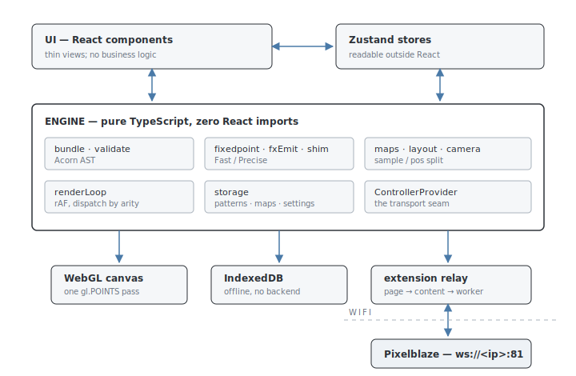

# PXLBLZ — Technical Reference

For engineers working *on* PXLBLZ, or evaluating how it's built. Using PXLBLZ is
the **Feature Guide**'s job; understanding Pixelblaze itself is the **Ecosystem
Primer**'s. This document is the single authoritative record of the design
decisions and the reasoning behind them; where any doc disagrees with the code,
the code wins.

**The whole document in two sentences.** PXLBLZ is an offline-first, no-backend
browser IDE: editing, transpiling, execution, and preview all happen in the page,
with an optional Chrome-extension relay as the only bridge to real hardware. Its
defining commitment is hardware fidelity — the preview reproduces the device's
fixed-point math, map semantics, and footguns, and nothing the preview invents
ever reaches a controller.

**Part 1** is the architecture: the stack, the defining decisions, and the system
map. **Part 2** is the subsystem reference: engine internals, the preview
pipeline, connectivity, storage, and the accepted divergences — complete, in
detail.

---

# Part 1 — The architecture

## 1. Technology stack & stance

| Concern | Choice | Why |
|---|---|---|
| Build / dev server | **Vite** | fast HMR; static output deployable to GitHub Pages |
| UI | **React + TypeScript** | mainstream, typed; thin view layer over the engine |
| Styling | **Tailwind CSS + shadcn/ui** | utility styling; a few headless components |
| State | **Zustand** | framework-agnostic stores readable/writable from the non-React engine |
| Editor | **Monaco** (`@monaco-editor/react`) | real IDE features: completion, markers, hovers |
| Parser | **Acorn** | standards JS AST; powers the transpiler, validator, fixed-point re-emit |
| Pattern storage | **IndexedDB** (raw API) | offline, structured, no backend |
| Preview draw | **WebGL** point cloud | one pipeline for 1D/2D/3D |
| Tests | **Vitest** | fast; jsdom for component smoke tests |
| Commit gate | **Husky** | `npm run lint && npm test` pre-commit |

The overarching stance: **offline-first, no backend.** Everything — editing,
transpiling, running, previewing — happens in the browser. The single deliberate
exception is live-Controller connectivity (§13): additive, optional, and routed
through a Chrome-extension relay rather than any server of ours.

## 2. The defining decisions

Six decisions shape everything in Part 2.

**Faithful fixed-point preview.** The preview can emulate the device's 16.16
fixed-point arithmetic exactly. The driver is shader porting: the common GLSL
hash `fract(sin(p·12.9898)·43758.5453)` overflows 16.16 on hardware while looking
perfect in float64, so a float-only preview cannot reveal that bug class — a
pattern would pass preview and fail on the device. This produces the
**two-renderer model**: **Fast** (float64, the editing default) and **Precise**
(faithful 16.16). Fidelity is a preview-only second emit path — the exported
artifact is plain unmodified code, since the device does fixed-point natively.
Two divergence classes are documented and accepted rather than chased:
**transcendental precision** (built-ins computed in float64 then quantized) and
**algorithmic identity** (`perlin`/`prng`/`wave` are different algorithms than
firmware). Only pure integer arithmetic is bit-identical on both sides — which is
why the library hashes are built from integer ops (§11).

**A hard engine/UI boundary.** Engine code (`src/engine/`) is pure TypeScript
with **zero React imports**; UI components are thin views over engine functions
and Zustand stores. Zustand specifically because the render loop and other engine
code read and write state outside React. This split is load-bearing for testing:
the tricky math and the transport-agnostic connectivity logic are unit-testable
with no DOM (§15).

**Everything that crosses to hardware is plain Pixelblaze code.** The bundler
only inlines and renames — never translates — so libraries are authored in the
Pixelblaze dialect (§4, §11). Map sources are plain browser JavaScript, exactly
as on real hardware, and stock maps are the very `.js` the user can read (§8).

**The sample/pos split.** Each preview point has two channels: **`sample`** — the
coordinates fed to the render function, always map-owned — and **`pos`** — where
the dot is drawn, owned by the map when it encodes real geometry or by a viewport
**embedding** when the pattern leaves position free. This one model spans 1D
shapes, 2D surfaces, and 3D maps (§8).

**Connectivity behind one seam.** All "how do we reach a Controller" knowledge
lives behind `ControllerProvider`; the UI never imports a transport. The v1
transport is a Chrome extension relaying `ws://` frames, because an https page
cannot open a LAN WebSocket itself (§13).

**Nothing the IDE invents for the preview ever reaches a controller.** Metadata,
the fixed-point emit, the settings cascade, light size, diffusion, solidity,
fidelity — all stay browser-side. Only the pattern artifact and, on request, the
map cross over (§14).

## 3. System map

### Zustand stores (`src/store/`)

| Store | Holds |
|---|---|
| `previewStore` | `isRunning`, `speed`, `brightness`, live `lightSize`/`diffusion`, the global-sticky `lightSizeSticky`/`diffusionSticky` baselines, `fidelity`, watcher state, `fps`, `elapsed`. Persists only `fidelity` and the two sticky baselines; cascaded fields are seeded per pattern by the resolver (§12). |
| `patternStore` | tri-state selection (`activePatternId` / `activeLibraryName` / `activeDemoName`), `userPatterns`, `demoOverrides` (per-demo cascade layer-1 bag), CRUD. |
| `editorStore` | `source`, `previewSource`, `compileStatus`, `isReadOnly`, `patternVars`, `controls`, `nativeDim`, `displayDim`, `solidEligible`, `editorFlavor` (`'pattern' \| 'map'`). |
| `mapStore` | `activeMapId`/`activeShapeId`/`activeSurfaceId`, `activePixelCount`, `activeNormalizeMode`, `activeSolidity`, `userMaps`, the stock catalogue, and the map-mode editing target. |
| `controlStore` | current pattern UI control values (transient). |
| `cameraStore` | ephemeral orbit angle, persistent auto-orbit flag, a transient `dragging` hold, pole wrap density. |
| `controllerStore` | keyed map of connected Controllers (IP → phase/nickname/map dim), the active one, extension presence, last-connected IP for auto-reconnect, the Send/push slices, and the sticky `saveArmed` toggle with mode-split dirty tracking (`lastPushedSource`/`lastSavedSource`). |
| `controllerPanelStore` | the connected device's polled live slice: active program + program list, FPS, device `pixelCount` (with in-flight `pixelCountPending` hold), installed-map point count, panel-owned volatile brightness and live controls. `seed`/`start` are keyed by owning IP so a same-device reopen keeps last-known values while a device switch clears. |

Each store exports `*InitialState`; tests reset with `setState(initialState)`
(merge mode). `previewStore`'s persist layer migrates legacy blobs (the retired
`grid`, pre-cascade per-pattern brightness/speed) forward into the current shape.

---

# Part 2 — Subsystem reference

## 4. Transpiler / bundler (`src/engine/bundle.ts`)

`bundle(patternSrc, libraries)` → `{ code, fxCode, metadata }`:

- **`code`** — the flat hardware/preview artifact: every referenced library
  function inlined and prepended, every `namespace.fn()` call rewritten to
  `_namespace_fn`, `export` keywords preserved. This is exactly what runs on the
  device and the only thing Copy/Download emit.
- **`fxCode`** — the fixed-point re-emit of `code` (§5), preview-only.
- **`metadata`** — preview-side companion, never sent to hardware.

**Parsing.** The pattern parses as an Acorn *module* (legal top-level
`export var`/`export function`); libraries as *scripts*.

**Tree-shaking & inlining.** `collectLibraryRefs` finds `lib.fn()` calls;
`resolveAllDeps` BFS-pulls each function's transitive same- and cross-library
references; `inlineFn` renames declarations and rewrites internal calls
(`mangle(ns, fn) → _ns_fn`). Only reachable functions are inlined —
function-level tree-shaking, critical for the device's memory limits. A pattern
referencing no libraries returns its source verbatim. The filename is the
namespace (`Shader.js` → `Shader.*`); libraries load eagerly via
`import.meta.glob('./lib/*.js', '?raw')`.

**Metadata extraction** records `exportedVars`, top-level `patternVars`,
`controls` (exported functions matching a control prefix, with `pickerVars`
recovering the backing vars for colour pickers), and `renderFns` (the presence
set driving dimensionality).

This is a faithful interfacing choice: the artifact must be valid Pixelblaze
code, so libraries are authored in the Pixelblaze dialect (plain `.js`,
Acorn-parseable) and the bundler does only inlining and renaming, never language
translation.

## 5. Fixed-point engine

Three pieces implement Precise mode.

### Representation & operators (`fixedpoint.ts`)

Every pattern number is its **raw int32** = `round(value × 65536)`. The `fx`
object implements the 16.16 operators, confirmed against a real device (fw 3.67):

- `add`/`sub`/compare — native ops with `| 0` int32-wrap.
- `mul` — exact `(a·b) >> 16` via 16-bit limb decomposition (float64 alone
  overflows past 2⁵³); the one expensive op.
- `div` — rounds `a×65536/b`; a documented sub-ULP divergence from the device's
  *truncating* divide, for non-power-of-two divisors only.
- `mod`/`frac` — truncate (sign of dividend), matching firmware.
- Bitwise — integer-coerce operands first (`raw >> 16`, op, `<< 16`), matching
  firmware's "bitwise over the integer part" (`~2.5 → -3`).

### Fixed-point re-emit (`fxEmit.ts`)

`emitFixedPoint(code)` re-parses the bundled source and re-emits it: numeric
literals become raw int32, operators become `fx.*` calls, array subscripts
truncate (`(i)>>16`), `++`/`--` step by one whole unit (65536). Unknown node
types fall back to the original source text — degrading to float math rather than
crashing.

### Fixed-point shim (`createFxShim`)

Wraps the float shim at a per-function seam: numeric args decode raw→float, the
float built-in runs, the numeric result re-encodes float→raw. A built-in's
internals run in float64; only its result is quantized to the 16.16 grid. The
seam exists so a firmware-matched LUT could replace an individual `fx.sin` if a
divergence ever proved visible — none has, so the hook is unused. Arrays,
palettes, `mapPixels` callbacks, and `transformPoint` get bespoke overrides
(their elements are already raw). `encodeScalar`/`decodeScalar` become
`fx.fromFloat`/`toFloat`, so the render loop, controls, and watcher stay
mode-agnostic and convert only at the boundary.

## 6. Validator & editor integration

### Validator (`validate.ts`)

`validateSource(source)` is pure, returning `ParseError[]` from two passes: an
Acorn syntax parse, then an AST rule walk collecting *every* Pixelblaze violation
(not just the first): non-`var` declarations, classes, `switch`, `new`,
`try`/`catch`/`finally`, `throw`, `import`. This encodes the language limitations
as live feedback. Object literals and closure-scope divergences are deliberately
not flagged — not statically detectable in the rule set.

### Editor propagation & map mode (`Editor.tsx`, `monaco/`)

Monaco runs a Pixelblaze language mode (`pixelblazeLanguage.ts`) with completion
and signature providers backed by `builtins.ts` plus all loaded library
functions, and library hover cards. `Editor.tsx` converts validator output to
Monaco markers and sets `editorStore.compileStatus`. Two propagation paths on
independent timers:

- **Preview push** — a 600 ms debounce (`PREVIEW_DEBOUNCE_MS`): clean source is
  pushed to `previewSource`, rebuilding the preview. Broken code is not pushed —
  the last clean version keeps running.
- **Auto-save** — a separate 4 s tick (`SYNC_TICK_MS`) writing clean source to
  IndexedDB.

The model is force-tokenized on mount and source swap (2000-line cap) to avoid a
flash of unhighlighted text; read-only files skip validation and clear markers.

The editor's second flavor is **map authoring** (`editorFlavor === 'map'`,
`mapAuthoring.ts` + `MapModeHeader.tsx`): a plain-JavaScript surface with a
**parse-only** badge (`parseMapSource` — an Acorn parse of `(${source})`; no
dialect walker, no shim, since a map is just a JS function expression). **New
Map** opens on `MAP_SKELETON`, a minimal valid 2D function. Stock maps open
read-only in the same flavor; **Clone** copies the stock source into a new custom
`MapRecord`, bakes it, and opens it editable. Custom map source **auto-bakes** on
the sync tick when it parses (`bakeMapSource` — plain-JS `new Function`, float64,
no shim). Auto-baking only updates the stored record; no map-mode action applies
itself to the running preview — assigning a map to a pattern happens only via the
preview **Map** control. Eval failures surface in the header without crashing.
Custom maps offer **Send map to Controller** and a confirmation-guarded
**Delete**; stock maps offer read-only state, **Clone**, and **Send map to
Controller**.

## 7. Runtime shim & built-ins (`shim.ts`, `builtins.ts`)

`createShim(config)` builds the Pixelblaze built-in surface as a plain object,
injected as named parameters to `new Function(...)` — nothing pollutes global
scope and the surface is mockable. It implements (float64 reference behaviour):
colour (`hsv`/`hsv24`/`rgb`, capturing the current pixel), waveforms and
interpolation (`time`, `wave`, `triangle`, `square`, `mix`, `smoothstep`,
beziers, `clamp`, `map`), the math/constant family (`frac` truncate-based, `mod`
floored), palettes (`setPalette`/`paint`), `perlin` plus the fractal family (Ken
Perlin's 2002 reference — not bit-identical to firmware), `prng` (mulberry32 —
algorithmically divergent), `clock*` (browser clock), the live coordinate
transform stack (a persistent 4×4 CTM applied via `transformPoint`), map
introspection sourced from the active map, and a Pixelblaze-semantics `array(n)`
Proxy.

**Inert stubs** (defined so patterns don't throw): hardware I/O, the
sensor-expansion globals (`frequencyData`, `accelerometer`, `light`, …), and
`nodeId`. Sensor-reactive patterns run without error but produce no motion — a
deliberate fidelity gap; the browser has no sensor board.

`builtins.ts` is a separate hand-maintained manifest feeding Monaco
completion/hover/signature hints, kept against the ElectroMage language
reference; there is no firmware auto-sync.

## 8. Maps, embeddings, and the sample/position split

The richest interfacing area. The core model:

- **`pixelCount` is independent of the map.** The render loop iterates
  `0…pixelCount-1` and asks the map for each index's position; the map is an
  index→position lookup, never the authority on count — mirroring hardware, where
  the two settings can disagree.
- **Each point has two channels** — `sample` (fed to the render fn, map-owned)
  and `pos` (where the dot draws; map-intrinsic for real geometry,
  viewport-supplied when the pattern leaves position free).

### Maps are source-backed plain JavaScript

A map function is plain JavaScript run in the browser — never the Pixelblaze
dialect, never the fixed-point shim — because that is exactly what hardware does.
Map evaluation is therefore faithful by construction.

Hardware's Mapper accepts two source formats — a literal JSON coordinate array,
or a `function(pixelCount)` returning one — authored in arbitrary real-world
units (the firmware normalizes from the coordinates' limits). The IDE
deliberately models **only the function flavor**: it is the superset (a static
array is a trivial function body), it is what `parseMapSource`/`bakeMapSource`
evaluate, and every stock map is expressed that way. The raw-units detail is
invisible downstream — normalization erases input scale.

Every stock map (`stockCatalogue.ts`) is a self-contained `function(pixelCount)`
in `src/engine/maps/sources/*.js` — `Math.*` and language built-ins only,
pasteable into a real Mapper tab — read raw via `import.meta.glob` and run
through a no-shim `new Function`. The `.js` a user views *is* the `.js` the
preview runs: single source of truth, no parallel generator to drift. Stock maps
**regenerate live** for any count, so they never go stale, and the same source is
pushable directly to a Controller.

The shipped catalogue (`STOCK_MAP_SPECS`): `plane` ("Square"), `wide`
("Wide 2:1"), `seed-ring-2d` ("Ring") in 2D; the 3D set in the shell/volume
naming scheme — `cube`/`cube-shell`, `star-shell`/`star-volume`,
`seed-sphere-3d` ("Sphere shell")/`sphere-volume`, `tetra-shell`/`tetra-volume`.
Shell entries carry a `normals` recipe (`'face' | 'star' | 'tetra' |
'centroid'`), whose presence is the solid-eligibility gate (§9). A lattice entry
carries a `grid` recipe (`'square' | 'wide' | 'cube'`) backing
`PixelMap.gridDims` — the live count→dims derivation; absent means `gridDims`
returns null (irregular clouds and shells).

### Custom maps bake on save

A custom map is evaluated **once** (float64, no shim) and its coordinate array
frozen into the `MapRecord`; `resolve(pixelCount)` replays that baked array
index-aligned. It does **not** re-run on a `pixelCount` change — deliberately
reproducing the hardware stale-map drift ("changed pixelCount, forgot to re-save
the Mapper"). A `MapRecord` carries `source`, `points`, and `gridDims` when the
points form a regular lattice. Baked replay applies to custom maps only (stock
maps regenerate). Opening or editing a custom map does not change `activeMapId`.

### Aspect normalization: Fill / Contain

One shared pass maps raw geometry into `[0,1]`, in one of two modes — both real
Mapper behaviours, a **per-pattern** choice persisted on
`PatternRecord.normalize`, defaulting to Contain:

- **Contain** (`normalizeAspect`) — aspect-preserving; longest axis → `[0,1]`,
  shorter axes proportionally smaller.
- **Fill** (`normalizeFill`) — each axis independently → `[0,1]`.

`applyNormalizeMode` re-stretches resolved Contain points to Fill live (no
re-bake). Applied identically to `sample` and `pos`. The map's resolved geometry
is the single source of the preview's extent and aspect.

### Viewport embeddings: shapes (1D) and surfaces (2D)

An embedding owns `pos` while the map owns `sample`; all embeddings are pure
`pos`-only generators.

- **Shapes** (`shapes.ts`, 1D): `line`, `ring`, and `pole` (a helix on a
  cylinder, drawn in 3D via `polePositions`, wrap density in `cameraStore`).
  Shared π-cell wall math in `cylinderWall.ts`.
- **Surfaces** (`surfaces.ts`, 2D): `flat` (identity) and `cylinder` (wraps the
  map's raw integer `gridDims` around a tube; `circumference : height =
  cols : rows`, fully map-derived).

Three embedding mechanisms, fixed by source-map arity: a 2D map can only wrap
onto a **developable** surface (Flat or Cylinder — a sphere needs a distortive
projection, a cube net only takes square-per-face grids); a 3D map owns its
geometry directly as a **shell** (boundary points, solid-eligible) or a
**volume** (interior fill, never solid-eligible).

### Layout routing (`layout.ts`)

Two orthogonal controls, not one union dropdown: **Map** (owns `sample`, filtered
by sample-arity) and **embedding** (owns `pos` — shapes for 1D, surfaces gated on
`gridDims` for 2D). `resolveLayoutSelection` restores a persisted selection if
still valid, else a default, optionally honouring a demo's recommended map.
`LayoutSelector.tsx` factors shared logic into `useLayoutControls()` and exports
the two controls separately so the deck can place them by what they are:
`MapSelect` renders inside the PIXELBLAZE block (stacked full-width, stock/user
subgroups) and returns nothing when there's no map; `EmbeddingSelect` renders on
the transport row, only when it offers a real choice.

`resolveLayout(input, deps): ResolvedLayout` is the single seam from a layout
*selection* to its drawn realization: selection-correction, map/shape/surface
resolution, the shared normalization, draw positions, solid-eligible normals, the
modeled `pixelCount`, and the `cols×rows(×depth)` readout label. The result's
`draw` is a discriminated union — `{ kind:'2d', positions }` or `{ kind:'3d',
positions, normals }` (normals present ⇔ solidity-eligible). `Preview.tsx` is
pure wiring over this; it holds no layout branching. To stay engine-pure,
`resolveLayout` takes its store-coupled lookups as injected `deps` — which also
makes every branch table-testable with fake maps (`resolveLayout.test.ts`).

The cylinder wrap and the readout label read the grid off the map itself —
`PixelMap.gridDims(count)` — so there are no map-id special cases: a map shows a
label exactly when `gridDims` is non-null. Each branch's modeled count runs
through one selector, `effectivePixelCount({ persisted, recommended, baked,
fallback })`, re-exported so the deck's editable count box reads the same chain
the renderer does.

### Recommended settings (`demos.ts`)

Read-only demos carry no `PatternRecord`, so a single preview-only table sets
better on-open defaults: `RECOMMENDED_SETTINGS`, keyed by curated-pattern id,
holding any subset of the cascaded fields (e.g. `AuroraSphere →
{ mapId:'seed-sphere-3d', pixelCount: 4096, solidity: 1 }`). This is layer 2 of
the settings cascade (§12). It sets on-open defaults only; a user override
outranks it, and none of it reaches the pattern source, the artifact, or a
controller — the physical Pixelblaze knows only patterns and maps, never
associations.

## 9. Solidity & surface normals

**Solidity** is a preview-only, per-pattern display property of any
normal-bearing embedding or shell map: a `0 = transparent → 1 = solid` slider
fading back-facing points so a solid object hides its own back. It is a soft
terminator fade — a `normal · viewDir` brightness multiplier folded into
`project3D` beside the depth cue; front-facing points are never touched, and the
slider sets the floor the back fades to. At `0` the multiplier is uniformly 1
(the see-through draw, bit-identical).

Eligibility is the presence of a per-point normal, and is **provenance-gated,
not geometry-inferred**: the IDE supplies a normal only because it owns the
generator. Analytic embeddings (Cylinder) emit normals from their formula;
faceted shells (Cube/Star/Tetra) emit per-face normals; a convex shell (Sphere)
derives `normalize(pos − centroid)` because its catalogue entry carries a
`normals` recipe — the resolver maps the tag to the derivation (`NORMAL_FNS`), so
no map-id strings leak in. A hand-imported sphere-shaped cloud carries no recipe
and is never solid-able. Normals are preview-only — never stored in a map or sent
to a controller (a Pixelblaze map is positions only). Solidity persists on
`PatternRecord.solidity`; `editorStore.solidEligible` gates the deck slider.

## 10. Pattern loading, render loop, and WebGL

### Loading (`loadPattern.ts`)

`loadPattern` strips `export`, appends a generated epilogue, and evaluates via
`new Function(...builtinNames, body)(...builtinValues)` → a `PatternHandle`. The
epilogue builds each render slot with the fallback chain
`render3D → render2D → render → noop`, so asking for a higher dimensionality than
defined transparently drops extra coordinates. `nativeDimension(renderFns)`
returns the highest render fn defined — driving default layout and title label,
not per-frame dispatch.

### Render loop (`renderLoop.ts`)

Per `requestAnimationFrame`: scale `realDelta` by playback speed and advance the
virtual clock; `beforeRender(encodeScalar(scaledDelta))`; then per index, read
the map point's `sample`, apply the transform stack, and dispatch by sample arity
(`≥3 → render3D`, `===2 → render2D`, else `render`); capture the colour;
`paint(...)`; report watch values and a ~500 ms-smoothed FPS. Runtime throws are
caught — the loop stops quietly and reports via `onError`.

### WebGL renderer (`renderer.ts`)

A thin WebGL wrapper over `camera.ts`. All pixels draw as one `gl.POINTS` call;
the fragment shader renders a per-source kernel — a solid round core plus an
optional raised-cosine glow tail.

- **Diffusion** is a per-source point-spread, not a frame blur.
  `diffusionGlow(diffusion, coreDiameterPx, pitchPx)` returns the grown quad
  size, a dissolving `coreFrac`, and an overlap-normalised `peak` so the field
  never dims or blows out.
- **2D/1D**: one additive pass (order-independent); the canvas is sized to the
  layout's bounds aspect.
- **3D**: an opaque depth-tested core pass (nearer orbs occlude farther) plus an
  additive glow-tail pass into the gaps. The solidity fade and depth cue ride
  here.
- Degrades to a no-op renderer with no GL context (jsdom/tests).

### Camera (`camera.ts`)

Pure, fully unit-tested. A locked-2D camera derives extent/aspect from the
layout's `pos` bounds (`posBounds2D`, `canvasSizeForBounds`,
`projectPosInBounds`). An orbit camera (`OrbitCamera{azimuth,elevation,roll}`)
applies `Rz·Rx·Ry` plus orthographic projection; `fit3DScale`/`modelHalfExtent`
keep the rotation-invariant bounding sphere in frame; `depthCue` and the solidity
terminator size and shade per vertex. Caps: `MAX_PIXEL_COUNT = 65,536` (freeze
guard), `MAX_GRID_AXIS = 256`.

## 11. Libraries, demos & the porting toolkit

**Libraries** (`src/pixelblaze/lib/`, read-only, openable, authored in the
Pixelblaze dialect): `Anim`, `Color`, `Coord`, `Noise`, `SDF`, `Shader` — each
with a `*.fidelity.test.ts` asserting Fast/Precise agreement.

**Demos** (`src/pixelblaze/demos/`, read-only, forkable): shader ports,
showcases, per-dimension test patterns, loaded at build time via
`import.meta.glob`.

**ShaderToy porting toolkit** (`Shader`), sequenced after fidelity because a port
is only worth doing if it survives upload. Key decisions:

- **No re-polyfilling.** `mix`/`smoothstep`/`clamp` are Pixelblaze built-ins with
  GLSL-matching signatures; `Shader` fills only genuine gaps.
- **`frac` vs `fract`.** Pixelblaze `frac` truncates; GLSL `fract` floors. They
  diverge for negatives, so `Shader.fract` is a distinct floor-based name, never
  a shadow of the built-in.
- **Integer-only hashes.** Only pure integer arithmetic is bit-identical
  preview↔hardware, so `hash21`/`hash11` are integer multiply/add, not the
  overflowing `fract(sin(…)·…)` idiom. They demote with `/ 256 / 256`
  (power-of-two, bit-exact) rather than `× 1/65536` (which the firmware number
  parser flushed to raw 0). Validated bit-identical on a real device.
- **Out of scope:** textures/`iChannel`, multipass feedback, `dFdx`/`fwidth`,
  `discard`, MRT, GLSL→3D porting. Automated GLSL rewrite is a non-goal.

**Performance** is its own living guide —
`docs/guides/Optimizing Pixelblaze patterns.md` — carrying the measured
per-built-in cost table from the hardware microbenchmark and the
bench-verifiable vs hardware-wisdom taxonomy.

## 12. Settings cascade & storage

### The per-pattern settings cascade

Effective preview settings resolve field-by-field through four layers, first hit
wins: **per-pattern override → recommended (curated patterns only) → user
global-sticky (comfort prefs only) → developer default**. The pure resolver is
`resolveSettings` (`src/engine/resolveSettings.ts`) over the `Settings`
vocabulary and `DEV_DEFAULTS` (`src/engine/settings.ts`); the store orchestration
seam is `src/store/settingsCascade.ts` (`seedActiveSettings` on open,
`writeCascadedOverride`/`writeHybrid` per control, `forkSettingsSnapshot`,
`resetActiveSettings`, `hasActiveOverrides`).

Layer-1 overrides are sparse and written only on genuine user manipulation: a
user pattern stores them on `PatternRecord.settings`; a demo stores them in
`patternStore.demoOverrides` (keyed by demo name, persisted), so a demo's tweaks
survive a reopen. `resetActiveSettings` clears whichever layer-1 bag is active —
a demo reverts to its recommendation, a user pattern to app defaults — and is
offered only when that bag is non-empty. `fidelity` is the one pure-global
field: never cascaded, persisted on its own.

### Storage (IndexedDB)

Database `pixelblaze-ide` (version 2): `patterns`, `settings`, `maps` stores.
`PatternRecord` carries the per-pattern overrides in a sparse
`settings?: Partial<Settings>` field — superseding older flat columns;
`migratePatternRecord` lifts pre-cascade records into the nested bag on read and
rewrites retired ids, schemaless throughout (no DB bump). Override writes go
through `updatePatternSettings` (a sparse merge that does not bump
`src`/`updatedAt`). `MapRecord` carries `source`/`points`/`gridDims` (§8).

Selection is tri-state (pattern / library / demo). **Create** writes a runnable
animated starter immediately. **Import** parses `.epe` JSON (`epeImport.ts`,
takes `sources.main`) into a new user pattern. **Fork** copies a read-only demo
into an editable pattern, snapshotting the demo's *effective* settings into the
new record as frozen layer-1 overrides — no live pointer back. CRUD helpers
accept an injectable `IDBFactory` for tests (`fake-indexeddb`).

## 13. Live Controller connectivity

The IDE can connect to a real Pixelblaze and mirror/drive it live: a status
surface, a live panel, and Send to Controller for patterns and maps. The whole
stack sits behind one provider seam; no UI imports a transport.

### The constraint that shapes everything

From an https deployment the browser cannot open `ws://<LAN-IP>:81` — mixed
active content, blocked outright (Ecosystem Primer §11). A helper outside the
browser sandbox must relay. The v1 helper is a **Chrome extension** (superseding
the originally anticipated Node "local bridge"): the page can't reach the device,
but the extension's service worker can.

### The isomorphic protocol core (`PixelblazeConnection`)

A framework-free `PixelblazeConnection` (injected `WebSocketLike` factory) speaks
the documented JSON + binary protocol on `ws://host:81`. It is the shared engine
across every transport — Node `ws` for tooling, browser `WebSocket`, the
extension relay — because each is just a different `WebSocketLike`. It serves:

- **The documented JSON API** plus the **divergence harness**
  (`test/divergence-harness/`, `npm run harness`), which sweeps a probe pattern
  against a real device and writes the committed divergence report gating the
  fidelity engine. Unit-tested against a fake in-memory WebSocket; the live tier
  runs out-of-band.
- **The binary-frame protocol** — `listPrograms` decode,
  `getControls`/`setControls`/`brightness`/`activeProgramId`, and the
  *undocumented* chunked pattern-push, verified on a real device.

### The provider seam (`ControllerProvider`)

`ControllerProvider` (`src/engine/ControllerProvider.ts`) is the firewall
containing the entire "how do we reach a Controller" decision. It exposes
`connect`/`disconnect`, a `ControllerStatus` subscription (`no-extension |
extension-present | connecting | connected | error`), the read/monitor surface
(`getConfig`, telemetry, `listPrograms`, controls, `brightness`,
`setPixelCount`), and the capability-gated
`compile`/`pushBytecode`/`getPixelMap`/`pushPixelMap`. The app imports only this
module and its types — never an extension API, `PixelblazeConnection`, or
`RelayWebSocket`. A `NullControllerProvider` (permanently `no-extension`) lets
the whole UI render before any backend exists. The `controllerProviderRegistry`
holds the active provider, a per-IP factory, and a global extension `detect`;
`main.tsx` installs the real ones, tests inject fakes.

### The extension backend (`ExtensionControllerProvider`, `RelayWebSocket`)

The v1 backend owns a `PixelblazeConnection` whose socket is a `RelayWebSocket` —
a `WebSocketLike` proxy tunnelling frames across a `window.postMessage` →
content-script → service-worker seam to a real `ws://` socket in the extension.
Because it satisfies the same `WebSocketLike`, the entire protocol engine drives
it unchanged — the relay adds transport, not protocol. Binary frames cross the
seam as base64 (`chrome.runtime` messaging is JSON-only).
`windowRelayTransport` is the one module that touches `window`; everything above
it is transport-agnostic and unit-tested with a fake relay emulating a device
end-to-end. The extension itself (`extension/`: manifest, `background.js` service
worker owning the sockets, `content.js`, an offscreen-hosted sandbox) stays on
the far side of the seam. The provider adds the extension-present handshake
(`detectHelper`), the status state machine, a keepalive ping, a liveness watchdog
(device declared gone after ~4 s of inbound silence even with no socket close),
and bounded auto-reconnect (MV3 can evict the service worker; a powered-off
Controller is expected back, so it keeps probing).

### Per-IP just-in-time host permissions

The extension must reach `ws://<LAN-IP>:81` and `http://<LAN-IP>/…` (compiler
fetch, `/pixelmap.dat` read-back) at runtime-discovered IPs, but Chrome match
patterns can't express "the local network", and a static broad grant reads as a
network-sniffing surface that fails Web Store review (#229). So LAN reach lives
in **`optional_host_permissions`**, granted **per device IP, just-in-time**; only
`https://discover.electromage.com/*` is a required host permission (discovery
must work before any IP is known). When the app connects to an ungranted IP, the
service worker opens the extension's action popup, which calls
`chrome.permissions.request({ origins: ['http://<ip>/*', 'ws://<ip>/*'] })` —
Chrome's native *"Allow access to `<ip>`?"* dialog is the actual grant. The popup
batches all discovered IPs into one request, so onboarding a fleet is a single
dialog. The grant gates every device-bound call; the reconnect path must
distinguish "socket failed" from "permission missing for this (new) IP" — a DHCP
reassignment re-triggers the popup rather than silently retry-failing. The helper
emits `permission-needed` as soon as it opens the popup; the provider carries it
as `authorizationNeededIp` on the `connecting` status, and the pill renders an
"authorize via the helper" hint so the page never sits silently through the 60 s
grant timeout. A declined grant surfaces as a typed
`ControllerPermissionDeniedError` so the store drops the half-created pill back
to idle. The build is distribution-agnostic — the identical manifest works from
the Web Store or loaded unpacked. If the IDE tab was already open when the helper
was installed, the **I've installed it** button re-runs detection and reloads the
tab when the content script is absent (Chrome injects static content scripts on
navigation, not retroactively).

### Auto-discovery (cloud, via the helper)

The browser cannot find devices on the LAN — **UDP beacon discovery is impossible
from an MV3 extension** (`chrome.sockets.udp` is a dead Chrome-Apps API), so the
reference clients' port-1889 beacon path is closed. The only viable path is
**cloud discovery**, and only from the helper:
`GET https://discover.electromage.com/discover` matches Controllers by public IP
and returns `{ id, ip, localIp, name, version, … }` records. The page can't read
it (no CORS header — the same wall as `ws://LAN`), but the service worker with a
host permission can. `background.js` owns the fetch; the result crosses the relay
seam as a `reqId`-keyed `discover`/`discover-result` round-trip,
connection-independent. The seam exposes `discover()` on `ControllerProvider`
(Null returns `[]`; failures return `[]`), maps `localIp` → connect address and
`id` → stable key, and the `ControllerBar` shows candidates as clickable rows
driving the existing keyed `addController(address)`. A discovered row carries its
`name` in as a seed nickname, so the pill is born named. Discovery runs
automatically when the connect dropdown opens, refreshes on a timer while open,
offers a manual rescan (spinner in flight), and filters out already-connected
Controllers.

### The in-app surface (status pills, panel)

- **Status + connect** live in the top-right `ControllerBar`: one interactive
  pill per connected Controller (status dot folded into the pill) plus one
  adaptive entry affordance whose dropdown adapts to extension presence. Pure
  view-models: `controllerStatusView`, `controllerPillView`. Connection state is
  keyed and multi-Controller in `controllerStore` — each Controller keyed by IP
  with its own isolated provider/socket/reconnect, exactly one active; the
  last-connected IP alone auto-reconnects on reload. Dot tones are the shared
  traffic-light vocabulary (`StatusDot`): dark-grey absent, grey idle, amber
  fast-blink connecting, green live, red error.
- **The name is cached and sticky.** The store persists the last-connected IP
  *and* its nickname, so on reload the pill is born named. The name only ever
  upgrades: a fresh `getConfig` name wins, but a transient empty read must not
  clobber a known name back to the IP — both the live patch and the persisted
  value guard on "did we actually read a name." Discovery rows and same-IP
  reconnects seed pending pills from the known name, so a named Controller never
  flashes its IP.
- **The live panel** is a pinned popover under the active pill.
  `controllerPanelStore` polls a small live slice (1 s);
  `controllerPanelView` renders rows of `DeckStat`/`DeckField`/`DeckSlider`:
  active pattern (id resolved to a name via program-list → local label cache →
  raw id) + brightness, map-points + pixel count, IP + FPS, then live controls.
  On connect the panel is warm-seeded once so it opens populated; a same-device
  close/reopen keeps the last-known slice (`stop` preserves, `seed` clears only
  on device switch). Brightness is panel-owned and volatile — seeded once from
  the device's first report, then slider-owned, always `save:false` (flash wear);
  control writes likewise. Both are coalesced through `throttleTrailing`
  (leading + guaranteed trailing flush, injectable clock) to ~10/s. The
  brightness slider is logarithmic (`DeckSlider`'s `curve` prop — position-only;
  callers pass real `0..1`). A pixel-count edit holds the entered value in
  `pixelCountPending` (input dimmed) until the slow `save:true` write settles, so
  a mid-write poll can't flash the stale count. A control whose device value
  isn't a finite `0..1` (`controllerSliderValue` → `null`) renders the
  indeterminate hollow-ring state with a `—` readout, still draggable — covering
  run-only patterns (no `getControls`) and saved patterns whose
  `activeProgram.controls` report drifted bound-variable values.

### Send to Controller — pattern push (`pushPattern`, `controllerBinding`)

`compile`/`pushBytecode` are capability-gated: the device's own compiler runs
inside the helper's offscreen sandbox (the only MV3-legal place to eval the
remote compiler), turning source into bytecode; `pushBytecode` sends it over the
socket. `pushPattern` owns the policy, in one of two modes chosen by the sticky
**Run / Save** pill (`controllerStore.saveArmed`, persisted); the Send button's
glyph and tooltip follow the armed mode via `describeSendAction`. Run and save
are tracked as independent acts — the dirty gate keys off `lastPushedSource` for
run and `lastSavedSource` for save, so a clean run push doesn't satisfy a pending
save. The modes:

- **Run-only** (default): compile, mint a throwaway program id, load + run via
  `pushBytecode` — the firmware's `setCode`/`putByteCode`/`pause:false` sequence
  (the reference client's `sendPatternToRenderer`). The pattern runs but is not
  persisted — it never enters Saved Patterns and its id resolves to no name. The
  `setCode` name is sent empty, matching the reference; the display name lives in
  the local label cache instead. Run-only deliberately does not consult or write
  the overwrite binding.
- **Save** (`persist: true`): compile, encode a **PBP blob** (`encodePbp`,
  `pbpEncode.ts`) — a 17-char id plus a 36-byte header of nine LE uint32s
  (version, then offset/length pairs for name/jpeg/bytecode/source) followed by
  the concatenated sections; the source rides as the firmware-required
  `{"main":<source>}` JSON container, LZString-compressed, the preview JPEG an
  empty section — and write it via `saveProgram` (`putSourceCode`, binary type 1,
  payload = id bytes + blob). This creates the `/p/{id}` record that shows in
  Saved Patterns with its name. Save then activates: it `pushBytecode`s under the
  same stable id (carrying the real name) so the device switches to the freshly
  saved program, and the store refreshes the panel's program list. Mirrors
  `PBP.fromComponents` / `PBP.toPixelblaze` in
  [pixelblaze-client](https://github.com/zranger1/pixelblaze-client/blob/9be84700248fa17f0123c702a2939213ba69800a/pixelblaze/pixelblaze.py#L2992).

**Overwrite-in-place** (`controllerBinding`) applies to save mode only, because
only a saved pattern enters the program list: each `(Controller, IDE pattern)`
pair remembers the device program id it last saved to and reuses it (an id the
user deleted on-device is silently re-minted, detected against the live
`listPrograms`). Run-only's id never lists, so binding it would churn a fresh id
every push. Control values are never in either push; the binding is identity
only, persisted in IndexedDB.

**Program label cache** (`withProgramLabel`) is a parallel structure, persisted
under its own IndexedDB key and keyed by device program id (not pattern id).
Every push records the pushed name against the program id it landed on, so the
panel can name a running program the device list doesn't know. The panel resolves
the active program's name in three tiers — program-list name → local label → raw
id — and a label-tier hit is surfaced with an *unsaved* marker, so
running-but-not-saved reads honestly. The two stores stay separate deliberately:
they answer different questions ("what is this program called?" vs. "which
program do I overwrite for this pattern?").

`sendToController` is the pure gate for the editor-header button: enabled only
when a Controller is connected, the pattern compiles, and — when known — its
dimensionality matches the installed map (an unknown map dim never blocks).
**Demos are pushable too**: the dirty gate and overwrite binding key off
`activePushKey(patternStore)` — the user pattern's id, or a `demo:`-namespaced
key — so a demo sends without forking. There is no pre-push preflight for
pattern pushes: the old pixel-count reconciliation was misleading (a pattern
push sends bytecode only and keeps the device's existing map, so a count
mismatch is cosmetic), so `preflight` returns warnings only for the map-push
path.

### Send map to Controller, and map read-back

A Pixelblaze stores one shared map per device, so a map push is a guarded
device-configuration act — always routed through the preflight dialog, never a
silent one-click. The open-map descriptor (`openMapForPushState`) covers both
editable custom maps (last baked points + source) and read-only stock maps
(baked on demand). `mapPush.ts` encodes the binary `mapData` blob (mirroring
`createMapData`/`setMapData` in pixelblaze-client
[`pixelblaze.py`](https://github.com/zranger1/pixelblaze-client/blob/9be84700248fa17f0123c702a2939213ba69800a/pixelblaze/pixelblaze.py#L1641)):
a 12-byte header of three LE uint32 `[formatVersion, numDimensions, bodyBytes]`
then each coordinate as a `formatVersion`-byte LE uint. **Deliberate divergence
from the reference:** our points are already firmware-normalized to `[0,1]` by
the preview layout (the user's Contain/Fill choice), so we scale straight through
and only clamp, rather than re-running the reference's per-axis Fill stretch
(which would silently break aspect). What the preview shows is exactly what the
device receives.

Three firmware facts gate the rest:

- **The exact-count rule.** A pushed map must contain exactly `pixelCount`
  coordinates or firmware silently drops it — frames report success, nothing
  changes (#204). So `resolveMapPushPoints` re-bakes the map source to the
  device's `pixelCount` before encoding (mirroring the reference
  `setMapFunction`), conforming any map whose `function(pixelCount)` honours its
  argument. A hard-coded point count can't conform — the remedy is setting the
  device count to match, which is why the panel's pixels row is editable
  (`setPixelCount(n, save:true)`). This is a push-time constraint, distinct from
  the post-hoc stale-map drift.
- **Map read-back is an HTTP GET of `/pixelmap.dat`, not a WS call** (#205).
  There is no "get map" WS message and `getConfig` carries no map data, so the
  helper fetches the file over HTTP (the same helper that fetches the device
  compiler). `numPixels = bodyBytes / numDimensions / formatVersion` from the
  header, so even the point count is a cheap parse — surfaced beside the panel's
  pixels row so the silently-dropped-map footgun is visible. Read-back also
  supplies the map dimensionality the Send gate uses. (The Fill/Contain fit mode
  is map-bound — saved with the map, not a standalone settings field — so it
  rides read-back too.)
- **Reducing the count must black out the tail first** (#222, verified on
  hardware). WS2812s hold their last value until re-clocked and the device only
  clocks `pixelCount` LEDs, so after a reduction the LEDs beyond the new count
  freeze lit. Nothing clears them as a side effect — not a `pixelCount` write,
  not a `putPixelMap`, and there is no per-pixel wire command (the canonical
  Pixelblaze UI leaves them lit too). The only mechanism is to clock the whole
  strip black while the count is still high, then shrink:
  `applyControllerPixelCount` zeroes brightness (`save:false`), waits one
  full-length dark frame (~400 ms), writes the new `pixelCount` (`save:true`),
  then restores brightness. It reads the restore brightness from `getConfig` and
  skips the blackout if that's unreadable (zeroing a brightness it can't restore
  would strand the strip dark). Both count-setting flows — the panel edit and the
  map-push "set count only" remedy — go through this one helper. A deliberate,
  hardware-honest maneuver: it does exactly what you'd do physically.

## 14. Export

- **Copy Code** — `bundle(source).code` to the clipboard; disabled while compile
  is broken.
- **Download** — the same artifact as `<sanitized-name>.js`. The fixed-point
  `fxCode` is preview-only and never exported.

The artifact is the only thing that crosses to hardware. Metadata, the
fixed-point emit, and the whole settings cascade stay browser-side — the
consistent rule of §2.

## 15. Testing

Pure engine functions are the primary target: transpiler, validator, fixed-point
ops, camera projection, map/shape/surface generators, normals, dimensionality,
storage, and the transport-agnostic connectivity logic (a fake relay emulates a
device end-to-end). React components get smoke coverage only. Library fidelity
tests (`*.fidelity.test.ts`) assert Fast/Precise agreement per function;
`fixedpoint.bench.ts` benchmarks the multiply hot path; the hardware
microbenchmark (`test/perf-harness/`) profiles real per-built-in cost to guide
pattern-perf advice. Husky runs `npm run lint && npm test` pre-commit; the live
hardware tier is excluded from the gate and run out-of-band.

## 16. Known limits & accepted divergences

- **Float64 vs 16.16** — Fast is float64; Precise is faithful 16.16 (±32768,
  1/65536, int32-wrap overflow).
- **Algorithmic divergence** — `perlin`/`prng`/transcendentals are different
  algorithms than firmware; documented, not chased. Only pure integer arithmetic
  is bit-identical.
- **Main-thread execution** — patterns evaluate and render on the main thread
  (`new Function()` + rAF + WebGL), with no worker isolation. A syntactically
  valid infinite loop freezes the entire tab; there is no watchdog (real hardware
  has one). The clean-compile debounce — re-evaluating only on the periodic
  clean-compile tick, never per keystroke — reduces but does not eliminate this.
  The deferred fix is **one combined worker**: pattern exec and OffscreenCanvas
  draw together in a single worker, so the whole hot loop lives off the main
  thread and pixel buffers never cross the boundary (only low-frequency
  control/camera messages do). A worker *relocates* execution, it does not
  accelerate it — its two real prizes are responsiveness (editor stays live while
  a heavy 3D pattern grinds) and a real watchdog (a worker can be
  `terminate()`d). It needs no `SharedArrayBuffer` (whose cross-origin-isolation
  headers GitHub Pages cannot set); transferables suffice. The honest cost is
  that the engine's synchronous orchestration becomes message-passing async at
  the `renderLoop` seam — so it is deferred until the watchdog or 3D
  responsiveness genuinely bites. The pure modules stay synchronously
  unit-testable regardless.
- **Inert sensors** — sound/sensor-expansion globals are stubs; reactive
  patterns run but don't animate.
- **`fidelity` is pure-global by design** — a machine/performance choice, never
  recommended and never per-pattern; it persists as one global value.

## 17. Pointers

- **Feature guide** (using the IDE) — `docs/reference/PXLBLZ Feature Guide.md`
- **Ecosystem primer** (the platform itself) —
  `docs/reference/Pixelblaze Ecosystem Primer.md`
- **Optimization guide** — `docs/guides/Optimizing Pixelblaze patterns.md`
- **Domain glossary** — `CONTEXT.md`
